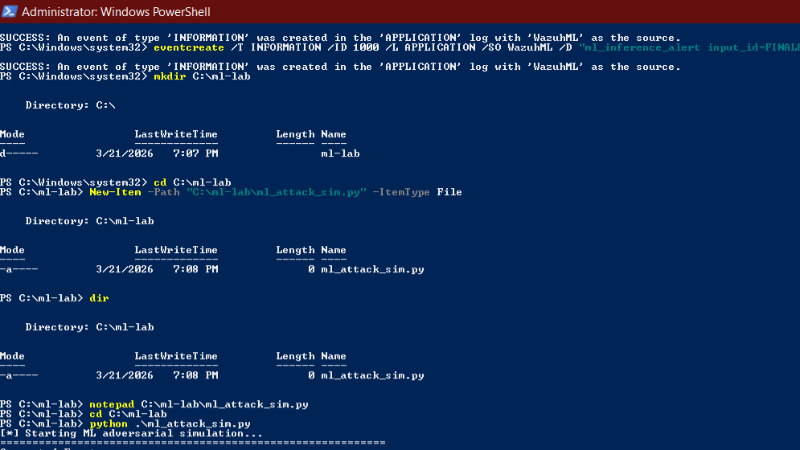
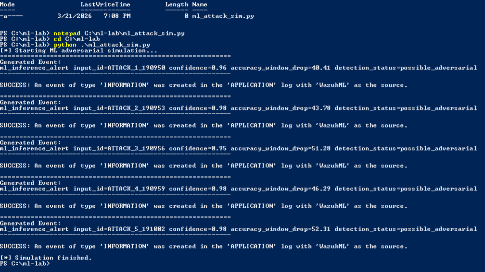
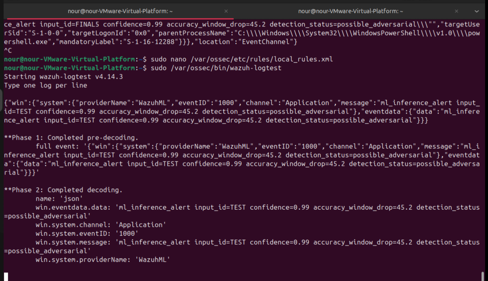
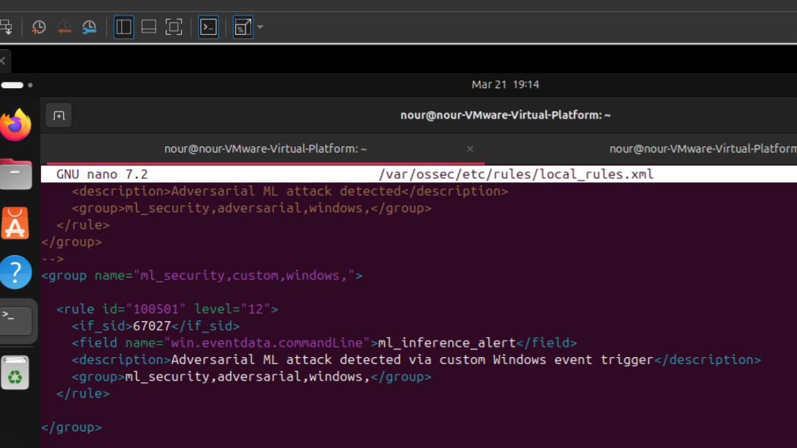
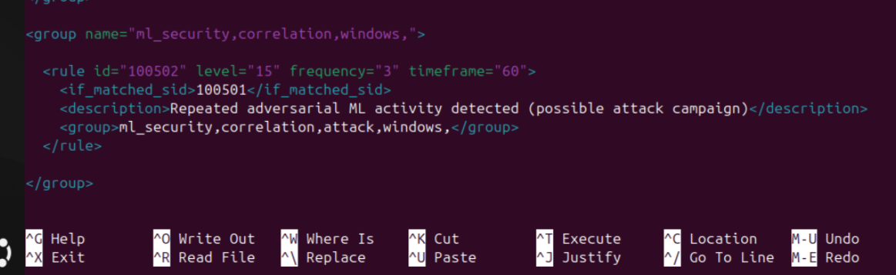
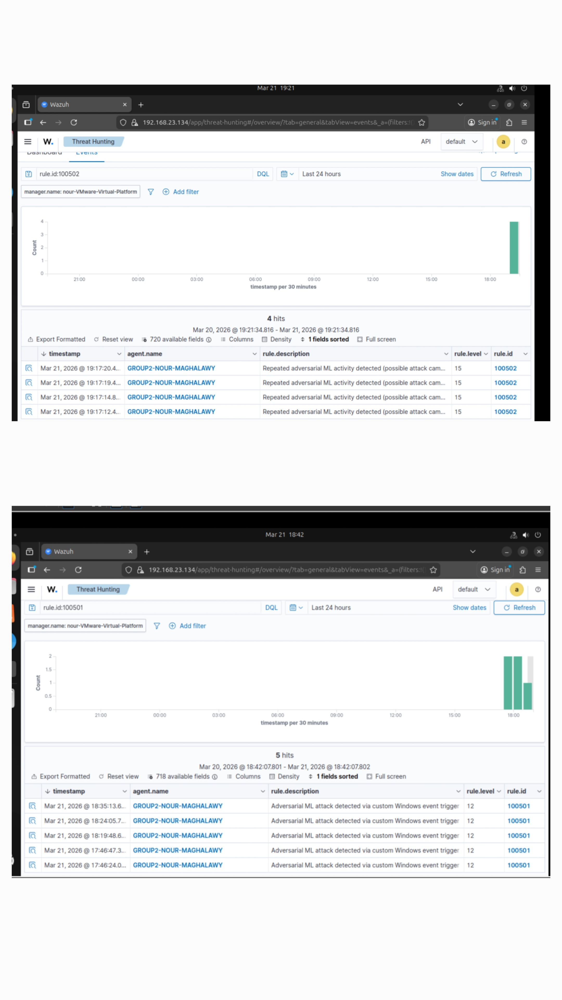

🚨 Adversarial ML Detection Lab using Wazuh SIEM

📌 Overview

This project demonstrates how adversarial machine learning behavior can be simulated and detected using Wazuh SIEM.

Unlike traditional attacks, adversarial ML targets the model itself, causing incorrect predictions while maintaining high confidence.

---

🎯 Why This Lab Matters

AI is becoming a new attack surface.

Traditional SOC tools cannot detect model manipulation unless ML behavior is transformed into observable security events.

➡️ This lab bridges the gap between AI security and SOC detection.

---

⚙️ Architecture

Python Simulation → Windows Events → Wazuh Agent → Wazuh Manager → Filebeat → Elasticsearch → Dashboard

---

🧪 Attack Simulation

A Python script generates dynamic adversarial ML behavior:

- Random input IDs
- High confidence values
- Accuracy degradation

➡️ Simulates real behavior instead of static logs.

---

🛡️ Detection Logic

Rule 100501

Detects ML anomaly indicators ("ml_inference_alert").

Rule 100502

Correlates repeated activity within 60 seconds (attack pattern).

---

🔍 Threat Hunting Queries

rule.id:100501
rule.id:100502
data.win.eventdata.commandLine: "ml_inference_alert"

---

🎯 MITRE ATT&CK Mapping

- T1059 – Command Execution
- T1204 – User Execution
- TA0002 – Execution

---

📊 Results

✔️ ML anomalies detected
✔️ Correlation alerts triggered
✔️ Real-time SIEM visibility

---

📸 Screenshots

"Simulation" (screenshots/01-python-simulation.png)
"Detection" (screenshots/05-alert-100501.png)
"Correlation" (screenshots/06-alert-100502.png)
"Dashboard" (screenshots/07-dashboard.png)

---

📄 Reports

- "Full Lab Report" (report/Adversarial_ML_Wazuh_Report.pdf)
- "Implementation Document" (report/Wazuh_Adversarial_Lab_Implementation.pdf)

---
## 📚 Documentation

- [Scenario Story](docs/scenario-story.md)
- [Incident Report](docs/incident-report.md)
- [Threat Hunting Queries](docs/threat-hunting-queries.md)
- [MITRE Mapping](docs/mitre-mapping.md)

## 📸 Lab Walkthrough

---

### 1️⃣ Python Simulation (Adversarial Event Generation)
This step simulates adversarial ML behavior by generating abnormal inference logs.

---

### 2️⃣ Windows Event Creation (Event Injection)
Custom adversarial events are injected into Windows Event Log using PowerShell.

---

### 3️⃣ Wazuh Logtest Validation
The event is tested using Wazuh logtest to verify parsing and rule matching.

---

### 4️⃣ Detection Rule Triggered (Rule 100501)
Custom rule detects adversarial ML patterns inside Windows logs.

---

### 5️⃣ Correlation Rule Triggered (Rule 100502)
Multiple events are correlated to detect a potential attack campaign.

---

### 6️⃣ SIEM Dashboard Visualization
Final alerts are visualized inside Wazuh SIEM dashboard.

👤 Author

Nour Maghalawy
SOC Analyst | Detection Engineering Enthusiast
